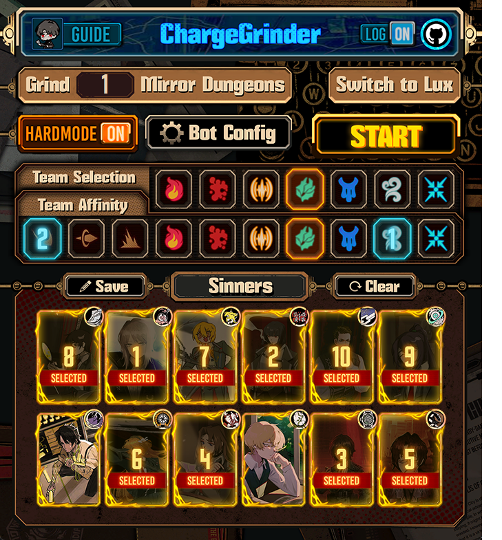
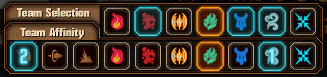
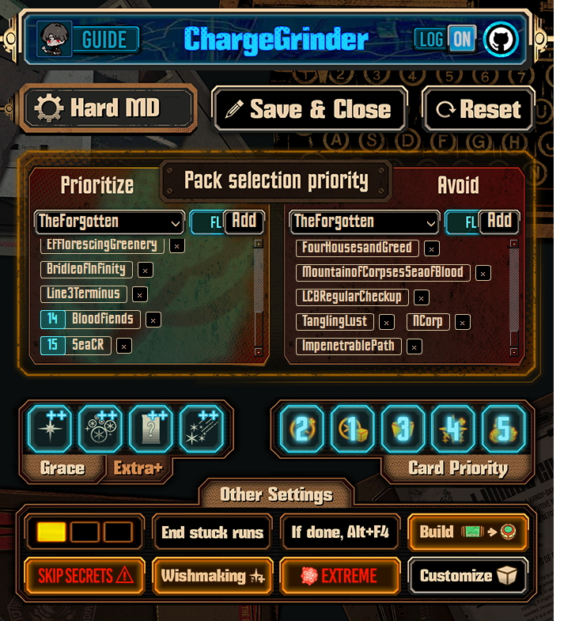
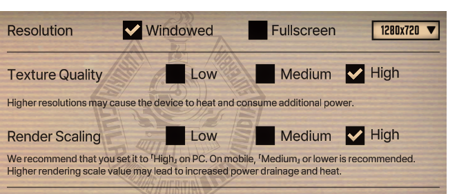

<div align="center">
<a href="https://github.com/AlexWalp/Mirror-Dungeon-Bot/releases/latest/download/app.exe">
  
</a>


</div>
<div align="center"> 
<a href="https://www.paypal.com/ncp/payment/98WFWFCUHLQML">
  
</a>
<a href="https://github.com/sponsors/AlexWalp">
  
</a>
</div>
<p align="center" > You can contact me on Discord: @walpth</p>

```
                   ________                             ______     _           __         
                  / ____/ /_  ____ __________ ____     / ____/____(_)___  ____/ /__  _____
                 / /   / __ \/ __ `/ ___/ __ `/ _ \   / / __/ ___/ / __ \/ __  / _ \/ ___/
                / /___/ / / / /_/ / /  / /_/ /  __/  / /_/ / /  / / / / / /_/ /  __/ /    
                \____/_/ /_/\__,_/_/   \__, /\___/   \____/_/  /_/_/ /_/\__,_/\___/_/     
                                      /____/

                          A Limbus Company bot that charges through MD6 for you
```

---



  - ### ⚡ Speed
  A **Normal MD6** run lasts between **23-25 minutes**.
  And it takes **35-45 minutes** for one **Hard MD** run with a Rupture team.

  - ### Starts from any moment of MD exploration

  - ### Restarts if run fails
  If all selected sinners are dead, the bot (with default settings) will restart the run.

  - ### Reclicks if action failed
    Sometimes timings mess up, so in order to address this issue most bot actions are verified.

  - ### Supports Luxcavation grind

<br clear="left" />

# Functionality:

- ## Auto-selects the team
  ### *This means that you need to set up the correct team names in advance.*
  ### Team Name Detection Rules

  - The bot determines the team to select based on the **keyword icon** assigned to that team.

  - #### 1. Supported Keywords
      - **Single word:**
  
        **SLASH, PIERCE, BLUNT,<br> BURN, BLEED, TREMOR, RUPTURE, SINKING, POISE, CHARGE,<br> WRATH, LUST, SLOTH, GLUT. , GLOOM, PRIDE, ENVY**

    - **Two-word combinations:**
      - Any combination of two of the above keywords (without `#number`) is also supported.

  - #### 2. Special Rules
    - **Single-word team names** can include `#number` (e.g., `SINKING#2`).
    - The bot scrolls through teams until it finds the **uppermost matching team**.
    - If multiple teams share the same keyword icon (e.g., in MD runs), the bot selects the **n-th occurrence** of that keyword in your team list.
        - **Example:** If searching for `"SINKING"` and it’s the second `"SINKING"` team in your setup, the bot will choose the **second occurrence**.  

          

  - #### 3. Fallback
    - If no matching keyword is found, the bot defaults to the **default team**.

  ### Supported name examples:

  

- ## Rotates teams
  

  ### Upper row:
  - *Orange* - currently displayed team
  - *Blue* - other teams included in the rotation
  - The rotation starts from the curretly displayed team and moves from left to right
  ### Lower row:
  - Affinities of the selected team
  - Affects EGO gift team build
  - Order matters, at least one is always selected


- ## Recommended Team
  - **Normal MD:** Rupture is the fastest team with average time of 24 minutes per run.  
  - **Hard MD:** Rupture is the best team with average time of 38 minutes per run.
  - **Extreme MD:** Both Rupture and Tremor are viable options.<br><br>

  

- ## Selects Floor Packs
  

    ### By default:
    - Avoids packs with high mortality rate and long fights such as:  
      **The Noon of Violet, Murder on the WARP Express, Full-Stopped by a Bullet, Timekilling Time, Nocturnal Sweeping** and some other.
    - Prioritizes floors with unique ego gifts such as:  
      **The Outcast, Hell's Chicken** and some other.
    <br>

    ### You can set your own pack priority in config!
    - ***Important note: Prioritized and Avoided packs are specific to each team.***
    - ***There are two different configs for Normal MD and Hard MD***

  <br clear="left" />

- ## Selects the best next node
  ### Bot can detect:

  

  ### Time cost of each node: <p>
  - **Event: 0s, Normal: 52s, Miniboss: 67s, Focused: 77s, Risky: 87s**

  ### The bot analyzes all visible nodes and builds the fastest path:

  

- ## Handles battles
  ### Normal MD:
  - Winrates focused encounters.
  - Chains skills 1 and 2 for human encounters. 
  - Skill 3 animations take more time than necessary so it is best to avoid it.
  - Doesn't use any EGO, because it is a huge time waste.<br><br>

  

  ### Hard MD:
  - **All battles** are winrated.
  - If the clash is **Struggling** or **Hopeless**, the bot uses the leftmost available EGO.
  - If a clash is **Struggling/Hopeless** and an EGO is selected, it will be replaced with a defense skill, provided there are fewer than 3 such cases.
  - If after EGO selection there are 3 or more **Struggling/Hopeless** clashes, replaces the EGO with high-rolling alternative.<br>
  
  High-rolling EGO options include: <br>

  ***Sunshower, Magic Bullet, Holiday, Effervescent Corrosion, Dimension Shredder, Ebony Stem, Binds, Ya Sunyata Tad Rupam, Garden of Thorns, AEDD, Lantern, Cavernous Wailing, Capote, Pursuance, Regret, Rime Shank, Wishing Cairn, Electric Screaming, 4th Match Flame, Red Eyes Open, Ardor Blossom Star, Blind Obsession, Fluid Sac, Hex Nail***
  - If there are still 3 or more **Struggling/Hopeless** clashes, goes for Damage instead of Win Rate<br><br>
  
  

- ## Fuses EGO gifts

  

  ### Makes a good team affinity build in shop
    - Fuses gifts to get powerful Tier 4s.
    - Upties and buys affinity-related gifts.
    - If not all gifts are visible, it can **scroll through inventory** while fusing.
    <br><br>

    **If lacking tier 4 for keyword(s):**
    - The bot aggressively fuses the **first Tier 4 gift**, even using same-affinity gifts if needed.
    <br><br>

    **Once a tier 4 for each selected affinity is obtained:**
    - Same-affinity gifts will **no longer be used for fusing**.
    <br><br>

    **Once the affinity build is complete:**
    - The bot will browse the shop for **same-affinity gifts** and buy them when found.

  <br clear="left" />


# Video showcase (old version 1.0.3):
<p align="center">
  <a href="https://www.youtube.com/watch?v=z3zJ8AMfWpw">
    
  </a>
</p>

# User warning!

This tool does not modify or access any game files and relies solely on the displayed information. <br> There have been no precedents of bans due to using this or similar tools, but I advise against excessive usage for longer than what is humanly possible. <br> I also advise against sharing your in-game ID along with the fact that you use this tool. | 
--- | 


# Installation
### 📦 Option 1: Run the Prebuilt Executable 
- ## Windows
  [](https://github.com/AlexWalp/Mirror-Dungeon-Bot/releases/latest/download/app.exe) <p>
  - Launch **app.exe** from [the latest release](https://github.com/AlexWalp/Mirror-Dungeon-Bot/releases/latest) - no additional files required.
- ## Linux (X11)
  [](https://github.com/AlexWalp/Mirror-Dungeon-Bot/releases/latest/download/CGrinder-x86_64.AppImage) <p>
  - Wayland is currently not suppored, so you would need to run X11 session.
  - Download AppImage from [the latest release](https://github.com/AlexWalp/Mirror-Dungeon-Bot/releases/latest).
  - Make it executable with `chmod +x CGrinder-x86_64.AppImage`.

### 🐍 Option 2: Run with Python
Make sure you have **Python 3** installed. Then either:

Windows: <br>
`pip install -r requirements.txt` 

Linux: <br>
`pip install -r requirements_linux.txt`

or manually install:
- `opencv-python-headless`
- `numpy`
- `PyQt6`
- `python-xlib` _(Linux only)_
- `mss` _(Linux only)_

Then you can run `App.py` to launch the application.

# Usage:

> **Game interface must be in English!** <br> **No mods installed (e.g. speech bubbles)** <br> **HDR should probably be disabled if you have it** <br> **Make sure that the Limbus Company window is fully visible!** <br> Set the in-game resolution to **16:9** ratio (**1920x1080** is best, but **1280x720** also works)


- You can set up sinners and other settings upon program execution. ChargeGrinder will start running in 10 seconds after that. 
- In the meantime you should switch to the Limbus Company window. It is not recommended to move the mouse while the bot is running, but you can Alt+Tab to another window and the bot will pause.

# Recommended Graphics Settings:


<h3>1920x1080</h3>

- Provides the best detection result
- If your screen is Full HD or lower with a 16:9 aspect ratio, use Fullscreen at your screen's native resolution
- If your screen resolution is higher than Full HD, use Windowed instead

<br clear="left" />


<h3>1280x720</h3>

- The resolution I usually test new versions with (and mostly use)
- Use windowed mode only

<br clear="left" />

# Run stats


### You can export run data from game.log file to game.csv

<br clear="left" />

### Example game.csv:
| NORMAL     | BURN |
|------------|------|
| Avg Time   | Count|
| 24:37      | 1    |

| Fights     | Normal | Focused | Risky | Miniboss | Boss | Total  |
|------------|--------|---------|-------|----------|------|--------|
| Floor1     | 00:47  | none    | none  | none     | 02:20| 05:02  |
| Floor2     | 00:44  | none    | none  | none     | 01:28| 04:29  |
| Floor3     | 00:39  | none    | 01:08 | none     | 01:01| 04:12  |
| Floor4     | 00:46  | none    | none  | 01:07    | 01:03| 04:17  |
| Floor5     | 00:52  | 01:47   | none  | none     | 01:49| 06:15  |

| Packs               | EmotionalRepression | AddictingLust | HellsChicken | TheOutcast | RepressedWrath |
|---------------------|---------------------|---------------|--------------|------------|----------------|
| Avg Time           | 04:12               | 04:17         | 04:29        | 05:02      | 06:15          |
| Count              | 1                   | 1             | 1            | 1          | 1              |